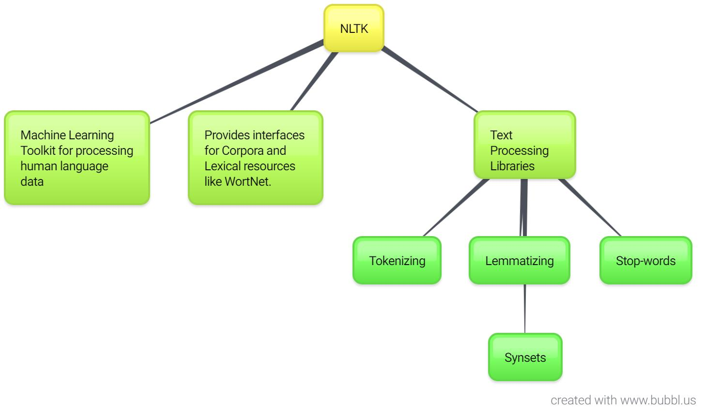

## Project Name
-------
## Document Similarity using Corpus Based Approach

------

## Project Description

### This approach uses semantically annotated corpora to train Machine learning algorithms to decide which word to use in which context. Corpus-based methods are supervised learning approaches when the training data is trained by the algorithms. The corpora and the lexical resource used is WordNet.

### I have used pos tagging to find the parts of speech in the texts and then using synsets to find the sense of the word.

### I have used two type of similarites to check the similarites between words:
* Path Similarity
* WUP Similarity [WuPalmer-Wordnet Similarity]

### Methods Used
* Machine Learning
* Text Mining
* Advance NLP

### Technologies 
* Python
* Genism
* Wordnet

### Usage
* The complete code can be seen in /Documnent_Similarity.ipynb

