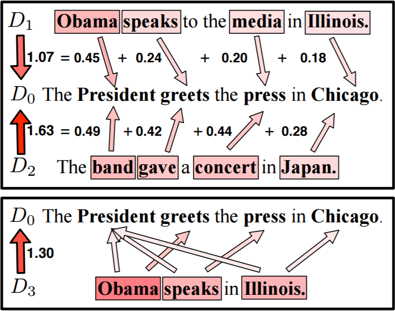

## Project Name
-------
## Document Similarity using Embedding Vectors - Cosine Similarity

------

## Project Description

### In this approach we represent documents as vectors of features, and compare documents by measuring the distance between these features. 

### To convert into vectors we can use 'Bag Of Words Vectorizer' or Pretrained Embedding Like 'Globe' or 'Word2Vec'.

### To find similarity between the vectors we can use Coinse Similarity to find the cosine distance between 2 vectors.
* Distance is inversely proportional to similarity.

### Methods Used
* Machine Learning
* Text Mining
* Advance NLP

### Technologies 
* Python
* Cosine Similarity
* Globe Embedding

### Usage
* The complete code can be seen in /Text_cosine_similarity.ipynb

