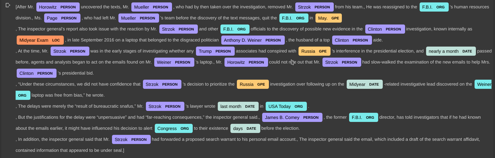

## Project Name
-------
## NAME-ENTITY RECOGNITION

-------

## Project Description

### Extraction Based Summarization:- 

#### Named entity recognition (NER)is a process of  information extraction that seeks to locate and classify named entities in text into pre-defined categories such as the names of persons, organizations, locations, expressions of times, quantities, monetary values, percentages, etc.

#### Used in many real-world questions, such as:
* Which companies were mentioned in the news article?
* Were specified products mentioned in complaints or reviews?
* Does the tweet contain the name of a person? Does the tweet contain this person’s location?

#### I have used two libraries for identity Name-Entity:
* NLTK which identity less entity with poor results.
* Spacy which, named entity recognition has been trained on the OntoNotes 5 corpus gives quite good results.

### Methods Used
* Machine Learning
* NLP
* Text Mining

### Technologies 
* Python
* SpaCy
* NLTK

### Usage
* The code to  identify name entity in documents ./Name_Entity_Recognition.ipynb

