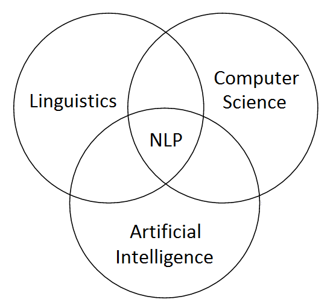

## Natural Language Processing - Text Mining
-----

This Repository is track of advance topics in Natural Language Processing (NLP),and Text Mining and implementing them form the basics.

I hope that you would enjoy while checking out those repositories and make changes into it.

 

|   PROJECT  |  DESCRIPTION  |  TECHNOLOGY  |  REPO LINK |
|-|-|-|-|
|`Topic Modeling`|`Finding different topics in a document.`|`Latent Dirichlet Allocation`|[Repository](https://github.com/soumyajit4419/Advance-NLP-Text_Mining/tree/master/Topic_Modeling)|
| | | | |
|`Document Similarity`|`Finding the similarity between documents`|`Semantic Text Similarity`, `Corpus Based Approach`|[Repository](https://github.com/soumyajit4419/Advance-NLP-Text_Mining/tree/master/%20Document_Similarity%20%5BCorpus%20Based%5D)|
| | | | |
|`Text Similarity`|`Finding the similarity between documents`|`Cosine Similarity`, `Embedding Based Approach`|[Repository](https://github.com/soumyajit4419/Advance-NLP-Text_Mining/tree/master/Document_Similarity%20%5BEmbedding_Based%5D)|
| | | | |

