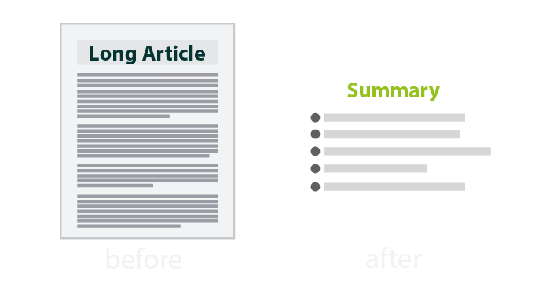

## Project Name
-------
## TEXT-SUMMARIZATION [Extraction Based Approach]

-------

## Project Description

### Extraction Based Summarization:- 

#### The extractive text summarization technique involves pulling keyphrases from the source document and combining them to make a summary. The extraction is made according to the defined metric without making any changes to the texts. Although sometimes the summary can be grammatically strange.

#### 

####  

### Methods Used
* Machine Learning
* NLP
* Tfidf Vectorizer
* Text Rank

### Technologies 
* Python
* 

### Usage
* The complete code can be seen in /Topic_Modeling_Newsgroup.ipynb

