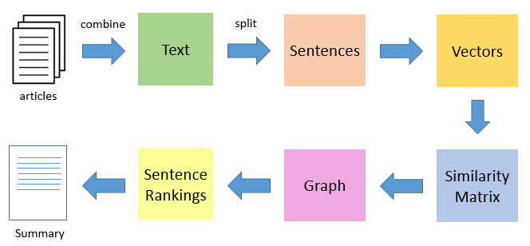

## Algorithm Name

### Summarization using the TextRank Algorithm

## Steps

* Then split the text into individual sentences.
*  Find the vector representation (word embeddings) for each and every sentence.
* Calculate Similarities between sentence using vectors and the results are stored in a simialrity matrix.
* The similarity matrix is then converted into a graph, with sentences as vertices and similarity scores as edges, for sentence rank calculation.
* On this graph, apply the PageRank algorithm to arrive at the sentence rankings.
* From the summary based on ranking.

## Explanation

* TextRank uses the intuition behind the PageRank algorithm to rank sentences.
* The probability of going from sentence A to sentence B is equal to the similarity of the 2 sentences.

## Implementation

The complete implementation code ./Text_Rank_Text_Summarization.ipynb
