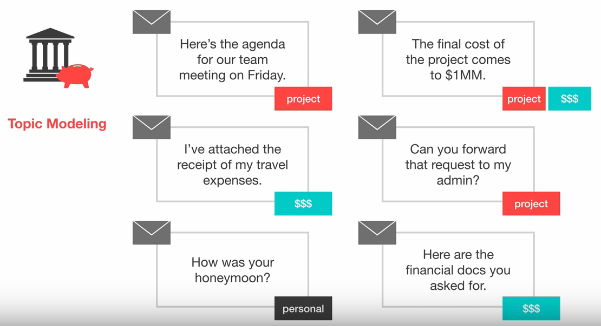

## Project Name
-------
## Topic Modeling using LDA(Latent Dirichlet Allocation)

------

## Project Description
####  Topic modeling is a type of statistical modeling for discovering the abstract “topics” that occur in a collection of documents.
####  Latent Dirichlet Allocation (LDA) is an example of topic model and is used to classify text in a document to a particular topic

#### I have used the 20newsgroup dataset that is available from sklearn. This dataset has news articles grouped into 20 news categories.Traing it with LDA and predicting topics from some new news.

### Methods Used
* Machine Learning
* Statistical Modleing
* NLP

### Technologies 
* Python
* Genism

### Usage
* The complete code can be seen in /Topic_Modeling_Newsgroup.ipynb

